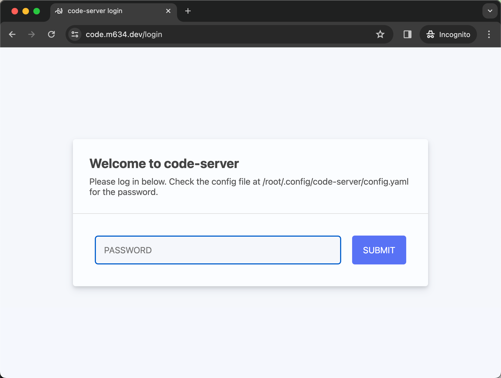

## Code Server

This uses `everking/code-server` docker image. Please update and build your
own image using [Dockerfile](./Dockerfile) as starting point. 
There might be other tools you want pre-installed. See the Dockerfile 
for details on what's included.

```
FROM node
# Core VS Code server install
RUN curl -fsSL https://code-server.dev/install.sh | sh

# Dev/build tools
RUN apt-get update; apt-get install default-jdk -y; apt-get install maven -y

# Network tools
RUN apt-get install telnet -y; apt-get install iputils-ping -y; apt-get install dnsutils -y

# Editors
RUN apt-get install vim -y; apt-get install nano -y

ENTRYPOINT [ "code-server", "--host", "0.0.0.0" ]

```

## Environment variables to set

* `CODE_PORT`
    * This will use `8086` if not set. Set it if you 
    already have a web resource using this port.
* `HOST_USER`
    * This will be used for a shortcut to access an external server.
* `HOST_PORT`
    * SSH port used with `HOST_USER`.
* `SSH_HOST`
    * SSH server to access.
* `WIN_USER`
    * Windows specific when SSH is running on the Windows level instead of WSL.
* `DEV_FOLDER`
    * This will allow code-server to access files on the server to read and write.
* `CODE_SERVER_PASSWORD`
    * Will be used to create `config.yaml` from [config.yaml-template](./config.yaml-template)
    * This is the password that will be used to access the portal.



## Attached resources

* `${HOME}/.ssh/id_rsa` and `${HOME}/.ssh/id_rsa.pub`

## Reference

* https://code-server.dev/
    * https://github.com/coder/code-server
* https://code.visualstudio.com/blogs/2022/07/07/vscode-server
